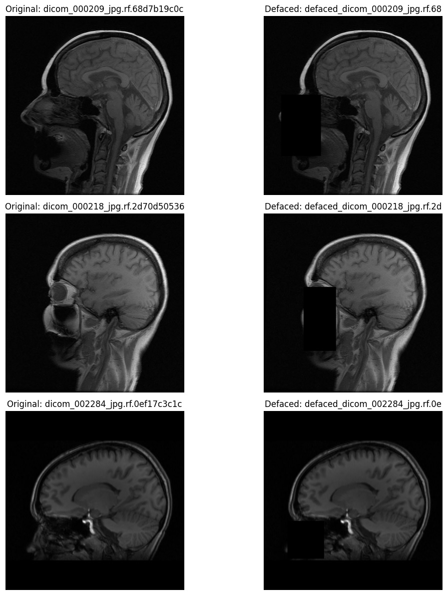

# Autonomous Multi-Agent MRI De-facing System

An advanced, self-correcting pipeline designed for the anonymization of medical MRI scans. This system employs a **Multi-Agent Architecture** to ensure robust patient privacy (de-facing) while intelligently preserving neuroanatomical structures for research integrity.

---

##  System Architecture

The system transitions from traditional static scripts to an **Agentic Workflow**. It coordinates four specialized agents in an iterative feedback loop:

1. **Detector Agent (YOLOv8):** Performs high-sensitivity facial landmark detection (eyes/nose) in grayscale MRI slices.
2. **Defacer Agent (The Executor):** Implements adaptive masking. It features a custom **Mask Shrinking** algorithm to prevent "over-masking" and protect critical brain tissue.
3. **Validator Agent (QA Specialist):** Re-scans the output to ensure no identifiable features remain above the safety threshold.
4. **Strategy Agent (The Brain):** Decides the escalation path. Supports two modes: **Rule-Based** (deterministic logic) and **Agentic AI** (Gemini 2.0 reasoning).

---

##  Key Technical Features

* **Iterative Refinement:** If the Validator Agent flags a residual feature, the system re-processes the image using a more aggressive strategy until safety criteria are met.
* **Adaptive Strategies:** Includes `Gentle` (Inpainting), `Moderate` (Gaussian Noise), `Maximum` (Black-box), and `Skull Strip` (Aggressive base removal).
* **Tissue Preservation:** Dynamic bounding box adjustment (`shrink_factor`) to balance privacy with data utility.
* **Batch Processing:** Automated pipeline for high-throughput medical datasets with ZIP export capabilities.
* **Current Scope:** The system is currently optimized for the **Sagittal plane**.

---

##  Visual Results

Below is a sample of the system's output showing the detection and successful de-facing of an MRI scan:

---

##  Project Modules

* **DetectorAgent:** Manages YOLOv8 inference and RGB-Grayscale conversion.
* **DefacerAgent:** Core geometric logic and adaptive masking algorithms.
* **ValidatorAgent:** Security auditing and confidence thresholding.
* **MultiAgentOrchestrator:** Central controller for state management and agent coordination.
* **StrategyAgents:** Logic providers for both Rule-Based and Gemini-API-driven decisions.

---

## 🔮 Future Roadmap: Brain-Aware Masking

To further improve precision, the next phase focuses on **Brain Segmentation Integration**:

* **Intersection Logic:** By training a secondary model (e.g., U-Net) for **Brain Tissue Segmentation**, we can implement an "Intersection-Over-Avoidance" logic.
* **Zero-Damage Guarantee:** This allows the system to apply maximum-security masking to the face while mathematically ensuring that not a single pixel of the segmented brain tissue is altered.
* **3D Support:** Expanding the agentic workflow to handle 3D NIfTI volumes directly.
* **Scalability:** The modular logic is designed to be extensible; the detection and masking modules can be further trained and adjusted to support **Axial** and **Coronal** planes for full 3D consistency.

---

##  Evaluation Summary

| Feature | Specification |
| :--- | :--- |
| **Model** | YOLOv8-Custom (Eye-Nose Class) |
| **Max Iterations** | 4 (Adaptive Escalation) |
| **Decision Logic** | Rule-Based / Gemini 2.0 Flash |
| **Implementation** | Python / OpenCV / PyTorch |

---

**Developed by M Safaei**
*Software Developer  | AI Engineer*
